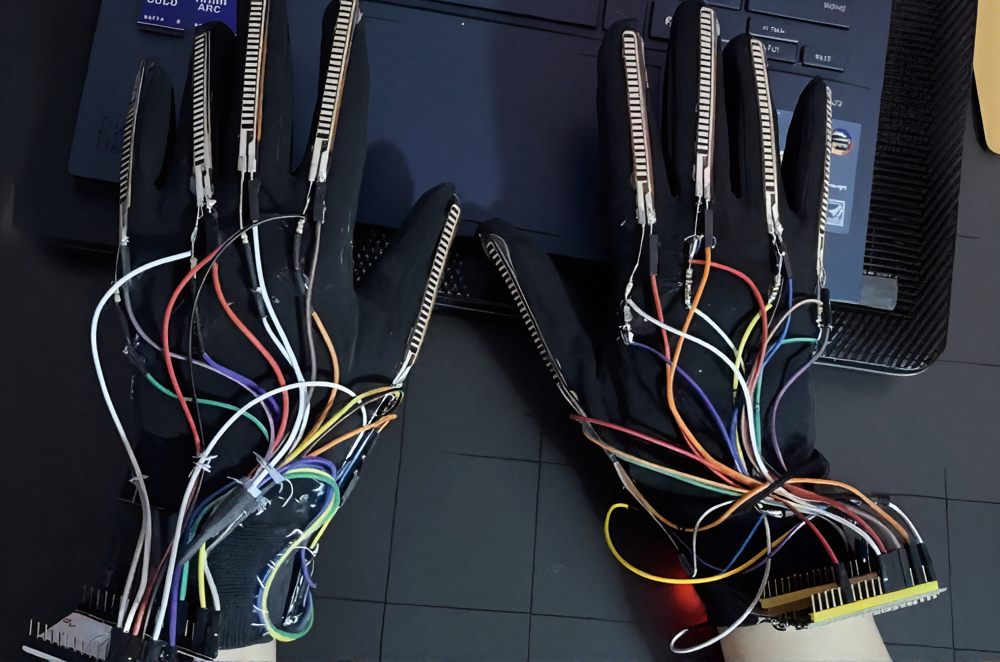
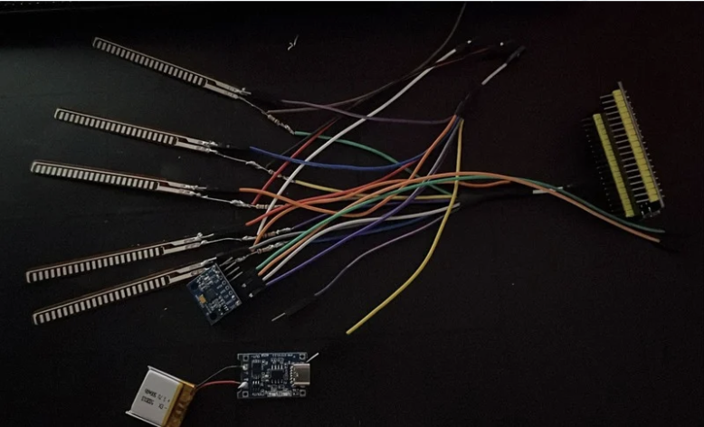
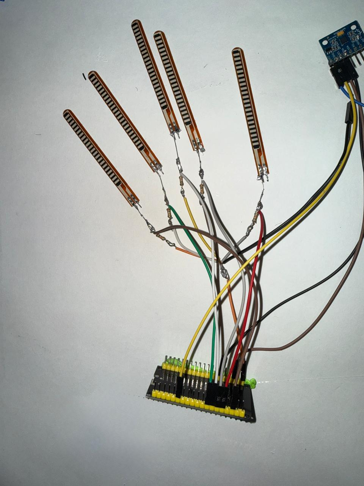

# 🤟 Dual-Glove: Intelligent Agent for Arabic Sign Language Recognition

  

## Overview

Dual-Glove is an AI-powered wearable system developed to facilitate communication between Deaf and hearing individuals through real-time Arabic Sign Language (ArSL) recognition.

The system utilizes two sensor-equipped smart gloves to capture finger movements and hand gestures. Sensor data is processed using Machine Learning algorithms to recognize Arabic Sign Language gestures and convert them into readable text and audible speech.

Unlike camera-based solutions, the proposed system is not affected by lighting conditions, background complexity, or hand occlusions, making it more reliable and portable.

---

## Problem Statement

Communication barriers remain a significant challenge for Deaf individuals in daily interactions.

Most existing sign language recognition systems rely on cameras, which can suffer from:

- Poor lighting conditions
- Background interference
- Occlusion of hand movements
- Limited portability

The Dual-Glove system addresses these limitations through wearable sensor-based recognition.

---

## Hardware Components

  

The system consists of:

- 2 ESP32 Microcontrollers
- 10 Flex Sensors
- 2 MPU6050 Accelerometer and Gyroscope Sensors
- Rechargeable Batteries
- Connecting Wires
- Wearable Gloves

---

## Hardware Architecture

  

Each glove contains:

- Five flex sensors attached to the fingers
- One MPU6050 motion sensor
- One ESP32 microcontroller

The sensors continuously capture finger bending and hand movement data, which is transmitted wirelessly for processing.

---

## System Workflow

1. The user performs an Arabic sign language gesture.
2. Flex sensors measure finger bending.
3. MPU6050 sensors capture hand orientation and movement.
4. ESP32 modules collect and transmit sensor readings.
5. Sensor data is preprocessed and calibrated.
6. Features are extracted from the collected data.
7. The Machine Learning model classifies the gesture.
8. The recognized sign is converted into text and speech.

---

## Machine Learning Pipeline

The collected sensor data undergoes:

- Data Acquisition
- Sensor Calibration
- Data Preprocessing
- Feature Extraction
- Gesture Classification
- Text Generation
- Text-to-Speech Conversion

---

## Dataset

The dataset was collected using the custom Dual-Glove system.

Each sample contains:

- Flex Sensor Readings
- Accelerometer Data
- Gyroscope Data
- Corresponding Arabic Sign Label

Preprocessing included:

- Noise Filtering
- Sensor Calibration
- Feature Normalization

Two different datasets were collected, one for words only, and another one for letters and numbers.

---

## Model Evaluation

The following Machine Learning models were evaluated:

- Neural Network (MLPClassifier) with 88.04% Accuracy
- Random Forest Classifier achieved 87.73% Accuracy
- SVM Classifier with 84.55% Accuracy

But XGBoost achieved the best overall performance on the words dataset with 97.95% Accuracy, and for the letters & numbers dataset Gradient Boosting was the best model with 96.41% Accuracy.

---

## Future Work

- Continuous sentence recognition
- Larger Arabic Sign Language vocabulary
- Additional gesture classes
- Cloud-based deployment
- Enhanced real-time performance

---

## 👨‍💻 Team Members

- [Laura Lucas](https://github.com/LauraLucasZ)
  - Hardware design, integration, and implementation of the smart glove system

- [Mariam Elbishbeashy](https://github.com/Mariam-Elbishbeashy)
  - Hardware design, integration, and implementation of the smart glove system

- [Aya Hisham](https://github.com/ayahisha)
  - Dataset collection, preprocessing, annotation, and validation

- [Mohamed Elrawy](https://github.com/MohamedIhabIbrahim22)
  - Machine learning model development, training, evaluation, and optimization

- [Sondos Mohamed](https://github.com/SondosGafar)
  - Text-to-Speech (TTS) integration and speech output development
  

---

## License

This project was developed as a part of Designing Intelligent Agents course at Misr International University (MIU).
